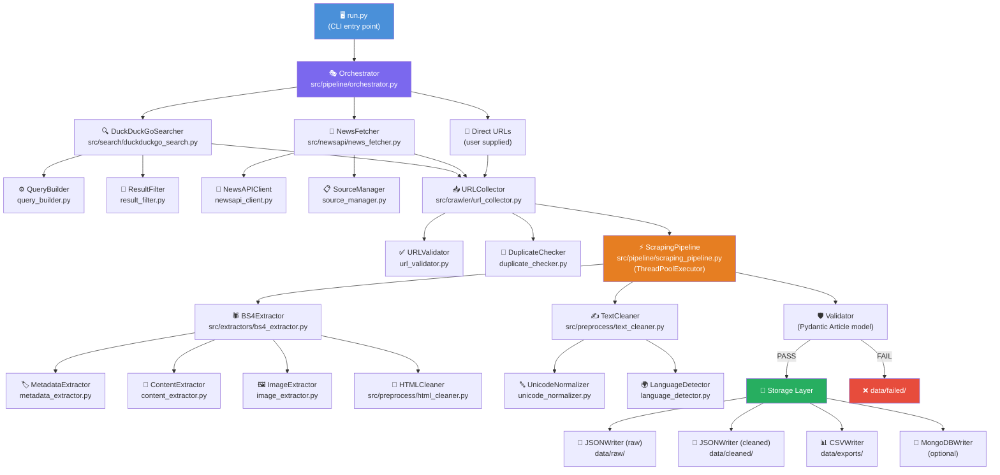
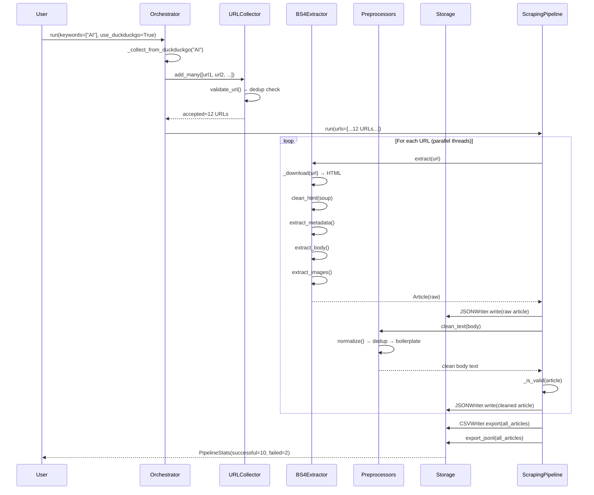
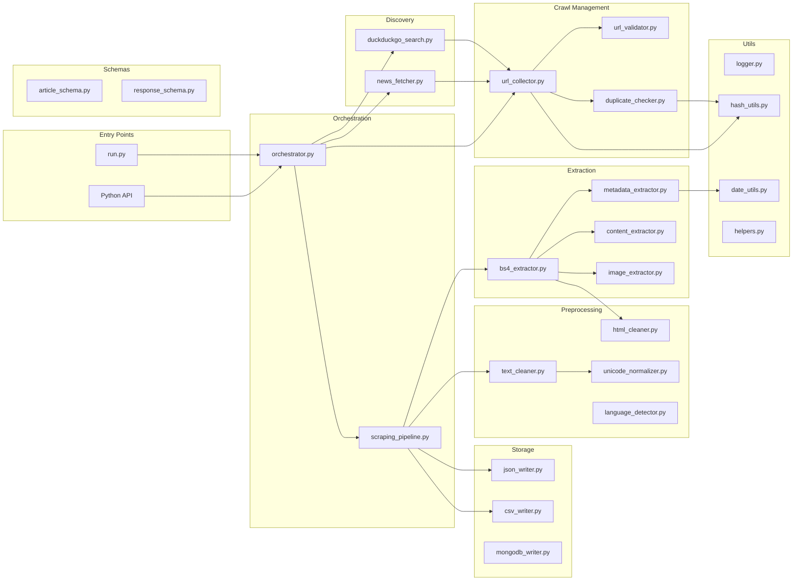

# 01 — System Overview & Architecture Flowchart

## What Is This System?

The News Scraper is a **modular, production-ready pipeline** that:
1. **Discovers** article URLs from three sources (DuckDuckGo, NewsAPI, direct input)
2. **Collects & deduplicates** URLs into a clean queue
3. **Downloads & parses** each webpage using BeautifulSoup4
4. **Extracts** structured data: title, author, date, body, images, metadata
5. **Cleans & normalises** the text (unicode, whitespace, boilerplate removal)
6. **Validates** the article meets minimum quality requirements
7. **Stores** results as JSON, CSV, and optionally MongoDB

---

## 🗺️ Full System Architecture



---

## 🔁 Data Flow — Step by Step



---

## 📦 Module Dependency Map



---

## 🗂️ Directory Layout at Runtime

After a successful run you'll see:

```
news_scraper/
├── data/
│   ├── raw/
│   │   ├── a3f8c1d2...sha256.json   ← One file per article (unprocessed)
│   │   └── b9e4f7a1...sha256.json
│   ├── cleaned/
│   │   └── a3f8c1d2...sha256.json   ← Same article, after cleaning
│   ├── failed/
│   │   └── bad_url_hash.json        ← Failed/rejected articles
│   └── exports/
│       ├── articles_20240315_143022.jsonl  ← Batch JSONL (one line/article)
│       └── articles_20240315_143022.csv    ← Flat CSV for Excel
└── logs/
    ├── scraper.log   ← All log levels (INFO, DEBUG, WARNING, ERROR)
    └── error.log     ← WARNING+ only
```

---

## ⚡ Key Design Decisions

| Decision | Why |
|----------|-----|
| **ThreadPoolExecutor** for extraction | I/O-bound HTTP requests — threads are ideal |
| **SHA-256 URL hash as article_id** | Stable, collision-resistant, dedup-friendly |
| **Pydantic v2 models** | Runtime validation, free JSON serialisation, type safety |
| **Separation of raw/cleaned data** | Can re-run cleaning without re-scraping |
| **Generic `ScraperResponse[T]`** | Consistent error handling across all modules |
| **Rotating log files** | Prevents disk exhaustion on long-running jobs |
| **MongoDB optional** | Works fully without it; just set `MONGODB_URI` to enable |
