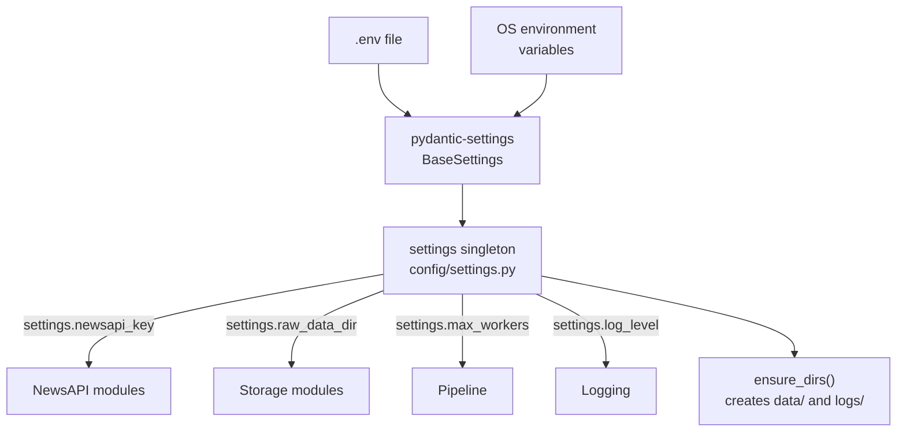
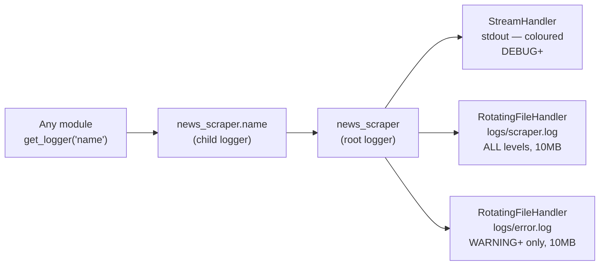

# 02 — Config & Logging

## Files Covered
- [`config/settings.py`](../config/settings.py)
- [`config/logging_config.py`](../config/logging_config.py)
- [`src/utils/logger.py`](../src/utils/logger.py)

---

## How Config Works



### `Settings` class — every field explained

| Field | `.env` key | Default | Used By |
|-------|-----------|---------|---------|
| `newsapi_key` | `NEWSAPI_KEY` | `""` | `NewsAPIClient` |
| `mongodb_uri` | `MONGODB_URI` | `mongodb://localhost:27017` | `MongoDBWriter` |
| `request_timeout` | `REQUEST_TIMEOUT` | `30` | `BS4Extractor`, `NewsAPIClient` |
| `max_retries` | `MAX_RETRIES` | `3` | `BS4Extractor`, `NewsAPIClient` |
| `retry_backoff` | `RETRY_BACKOFF` | `2.0` | `retry()` decorator |
| `rate_limit_delay` | `RATE_LIMIT_DELAY` | `1.0` | `DuckDuckGoSearcher` |
| `max_workers` | `MAX_WORKERS` | `5` | `ScrapingPipeline` ThreadPool |
| `ddg_max_results` | `DDG_MAX_RESULTS` | `50` | `DuckDuckGoSearcher` |
| `raw_data_dir` | `RAW_DATA_DIR` | `data/raw` | `JSONWriter` (raw) |
| `cleaned_data_dir` | `CLEANED_DATA_DIR` | `data/cleaned` | `JSONWriter` (cleaned) |
| `log_level` | `LOG_LEVEL` | `INFO` | All loggers |

### `ensure_dirs()` — called automatically
Creates all data and log directories on startup so the system never crashes
due to a missing folder.

---

## How Logging Works



### Log format
```
2024-03-15 14:30:22 | news_scraper.pipeline | INFO     | scraping_pipeline:45 | Pipeline starting | urls=12 | workers=5
```

Fields: `timestamp | logger_name | level | module:line | message`

### `ColouredFormatter`
Adds ANSI colour codes to level names in the console:
- `DEBUG` → Cyan
- `INFO` → Green
- `WARNING` → Yellow
- `ERROR` → Red
- `CRITICAL` → Magenta

---

## Manual Testing

### Setup (run once per session)
```powershell
cd c:\LATEST\news_detection\Model_v3\news_scraper
$env:PYTHONPATH = (Get-Location).Path
C:\Users\vinuj\anaconda3\python.exe
```

### Test 1 — Load settings and inspect all values
```python
from config.settings import settings

# Print all key values
print("NewsAPI key set:", bool(settings.newsapi_key))
print("Raw data dir:", settings.raw_data_dir)
print("Cleaned dir:", settings.cleaned_data_dir)
print("Max workers:", settings.max_workers)
print("Request timeout:", settings.request_timeout)
print("Log level:", settings.log_level)
print("DDG max results:", settings.ddg_max_results)
```

**Expected output:**
```
NewsAPI key set: False          ← True if you filled .env
Raw data dir: C:\LATEST\...\data\raw
Cleaned dir:  C:\LATEST\...\data\cleaned
Max workers: 5
Request timeout: 30
Log level: INFO
DDG max results: 50
```

### Test 2 — Override a setting via environment variable
```python
import os
os.environ["MAX_WORKERS"] = "10"

# Re-import (Settings re-reads env on each instantiation)
from pydantic_settings import BaseSettings
from config.settings import Settings
s2 = Settings()
print("Max workers overridden:", s2.max_workers)   # → 10
```

### Test 3 — Verify directories were created
```python
from config.settings import settings
from pathlib import Path

dirs = [
    settings.raw_data_dir,
    settings.cleaned_data_dir,
    settings.failed_data_dir,
    settings.exports_dir,
    settings.log_dir,
]
for d in dirs:
    print(f"{'✅' if d.exists() else '❌'} {d}")
```

### Test 4 — Use the logger
```python
from src.utils.logger import get_logger

log = get_logger("manual_test")
log.info("Hello from manual test!")
log.warning("This is a warning")
log.error("This is an error")

# Now check logs/scraper.log — all 3 messages appear
# Check logs/error.log  — only the warning and error appear
```

**Expected console output (coloured):**
```
2024-03-15 14:30:22 | INFO     | Hello from manual test!
2024-03-15 14:30:22 | WARNING  | This is a warning
2024-03-15 14:30:22 | ERROR    | This is an error
```

### Test 5 — Confirm log files were written
```python
import os
log_dir = settings.log_dir
for f in log_dir.iterdir():
    size = os.path.getsize(f)
    print(f"{f.name}: {size} bytes")
```
