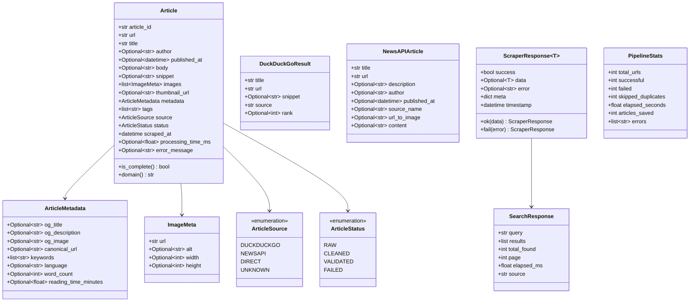
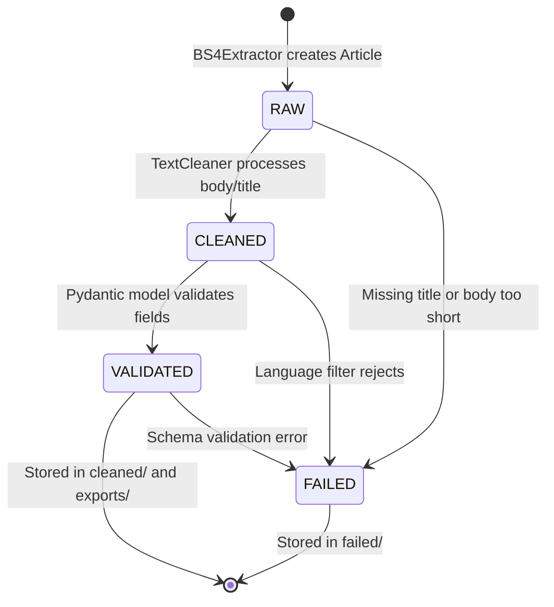

# 03 — Pydantic Schemas

## Files Covered
- [`src/schemas/article_schema.py`](../src/schemas/article_schema.py)
- [`src/schemas/response_schema.py`](../src/schemas/response_schema.py)

---

## Model Hierarchy



---

## Article Lifecycle (status transitions)



---

## `ScraperResponse[T]` — The Universal Envelope

Every module returns a `ScraperResponse` so callers always know the shape:

```python
# Success path
response = ScraperResponse.ok(data=my_data, query="AI", elapsed_ms=120)
# response.success == True
# response.data   == my_data
# response.meta   == {"query": "AI", "elapsed_ms": 120}

# Failure path
response = ScraperResponse.fail("Rate limit hit", query="AI")
# response.success == False
# response.error  == "Rate limit hit"
# response.data   == None
```

---

## Manual Testing

### Setup
```powershell
cd c:\LATEST\news_detection\Model_v3\news_scraper
$env:PYTHONPATH = (Get-Location).Path
C:\Users\vinuj\anaconda3\python.exe
```

### Test 1 — Create a valid Article manually
```python
from src.schemas.article_schema import Article, ArticleSource, ArticleStatus

article = Article(
    article_id="abc123",
    url="https://example.com/news/ai-breakthrough",
    title="AI Makes Major Breakthrough",
    body="Scientists have announced a major leap forward in artificial "
         "intelligence research. The new model surpasses all previous "
         "benchmarks on reasoning tasks.",
    source=ArticleSource.DIRECT,
    status=ArticleStatus.RAW,
)

print("ID:", article.article_id)
print("Title:", article.title)
print("Domain:", article.domain())
print("Complete:", article.is_complete())
print("Status:", article.status.value)
```

**Expected:**
```
ID: abc123
Title: AI Makes Major Breakthrough
Domain: example.com
Complete: True
Status: raw
```

### Test 2 — Article fails if both body AND snippet are missing
```python
from pydantic import ValidationError

try:
    bad = Article(
        article_id="x",
        url="https://example.com",
        title="Test",
        # body=None, snippet=None  ← both missing!
    )
except ValidationError as e:
    print("Validation failed (expected):")
    for err in e.errors():
        print(" -", err["msg"])
```

**Expected:**
```
Validation failed (expected):
 - Value error, Article must have at least a body or snippet.
```

### Test 3 — URL tracking param stripping in hash
```python
from src.utils.hash_utils import url_hash

url_clean   = "https://bbc.com/news/article-123"
url_tracked = "https://bbc.com/news/article-123?utm_source=twitter&fbclid=xyz"

print("Clean hash:  ", url_hash(url_clean)[:16])
print("Tracked hash:", url_hash(url_tracked)[:16])
print("Same?", url_hash(url_clean) == url_hash(url_tracked))
```

**Expected:**
```
Clean hash:   a4f8c1d29e3b7f01
Tracked hash: a4f8c1d29e3b7f01
Same? True
```

### Test 4 — ScraperResponse wrapping
```python
from src.schemas.response_schema import ScraperResponse, SearchResponse

# Simulate a successful search
resp = ScraperResponse.ok(
    data=SearchResponse(query="AI", total_found=5, source="duckduckgo"),
    elapsed_ms=230.5,
)
print("Success:", resp.success)
print("Source:", resp.data.source)
print("Meta:", resp.meta)

# Simulate failure
fail = ScraperResponse.fail("Connection timed out", attempt=1)
print("Error:", fail.error)
print("Data:", fail.data)
```

### Test 5 — Serialise an article to JSON
```python
import json
from src.schemas.article_schema import Article, ArticleSource

art = Article(
    article_id="test001",
    url="https://reuters.com/tech/ai-2024",
    title="Reuters AI Report",
    snippet="A brief description of the article.",
    source=ArticleSource.NEWSAPI,
)

json_str = art.model_dump_json(indent=2)
print(json_str[:500])
```

### Test 6 — ImageMeta and ArticleMetadata sub-models
```python
from src.schemas.article_schema import ImageMeta, ArticleMetadata

img = ImageMeta(url="https://cdn.example.com/photo.jpg", alt="Photo", width=800, height=400)
print("Image URL:", img.url)
print("Dimensions:", img.width, "x", img.height)

meta = ArticleMetadata(
    og_title="AI Report 2024",
    keywords=["AI", "machine learning", "GPT"],
    word_count=1200,
    reading_time_minutes=6.0,
)
print("Keywords:", meta.keywords)
print("Reading time:", meta.reading_time_minutes, "mins")
```
