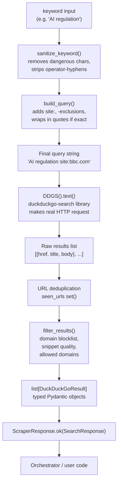

# 04 — DuckDuckGo Search Module

## Files Covered
- [`src/search/duckduckgo_search.py`](../src/search/duckduckgo_search.py)
- [`src/search/query_builder.py`](../src/search/query_builder.py)
- [`src/search/result_filter.py`](../src/search/result_filter.py)

---

## How It Works



---

## Function Reference

### `query_builder.py`

#### `sanitize_keyword(keyword: str) → str`
Strips characters that could break search queries:
- Allows: letters, numbers, spaces, mid-word hyphens, apostrophes
- Removes: semicolons, quotes, SQL-injection-style characters
- Strips leading/trailing hyphens from each word token
- Collapses multiple spaces

```
"hello; DROP TABLE--"  →  "hello DROP TABLE"
"AI   news"            →  "AI news"
```

#### `build_query(keyword, *, site, exclude_terms, exact_phrase, date_range) → str`
Assembles the final search string:
- `exact_phrase=True` → wraps multi-word keyword in `"double quotes"`
- `site="bbc.com"` → appends `site:bbc.com`
- `exclude_terms=["ads"]` → appends `-ads`

```
build_query("climate change", site="bbc.com", exclude_terms=["sport"])
→ 'climate change site:bbc.com -sport'

build_query("OpenAI", exact_phrase=True)
→ '"OpenAI"'
```

---

### `result_filter.py`

#### `filter_results(results, *, min_snippet_length, allowed_domains, blocked_domains) → list`
Post-processes raw DDG results:

| Check | Action |
|-------|--------|
| Invalid URL | Drop |
| Domain in blocklist | Drop (reddit, twitter, facebook, google, etc.) |
| Snippet shorter than `min_snippet_length` | Drop |
| Not in `allowed_domains` (if provided) | Drop |
| Duplicate URL | Drop (keeps first occurrence) |

**Built-in blocklist:** `google.com`, `reddit.com`, `twitter.com/x.com`, `facebook.com`, `linkedin.com`, `youtube.com`, `bit.ly`, `t.co` and more.

---

### `duckduckgo_search.py`

#### `DuckDuckGoSearcher.__init__(max_results, region, safesearch, rate_limit_delay)`
Creates the searcher with config defaults from `settings.py`.

#### `DuckDuckGoSearcher.search(keyword, *, page_size, pages, site, exclude_terms, apply_filters) → ScraperResponse[SearchResponse]`
The main search method:

1. Sanitises and builds the query
2. Opens a `DDGS()` context (rate-limit aware)
3. Iterates raw results, deduplicates URLs
4. Pauses `rate_limit_delay` seconds every `page_size` results (prevents bans)
5. Optionally passes through `filter_results()`
6. Returns typed `ScraperResponse[SearchResponse]`

**Error handling:**
- `DuckDuckGoSearchException` → logs warning, returns `ScraperResponse.fail()`
- Any unexpected exception → logs traceback, returns `ScraperResponse.fail()`
- Empty keyword → returns `ScraperResponse.fail("Empty or invalid keyword.")`

---

## Manual Testing

### Setup
```powershell
cd c:\LATEST\news_detection\Model_v3\news_scraper
$env:PYTHONPATH = (Get-Location).Path
C:\Users\vinuj\anaconda3\python.exe
```

### Test 1 — `sanitize_keyword` edge cases
```python
from src.search.query_builder import sanitize_keyword

tests = [
    "climate change",
    "hello; DROP TABLE--",
    "AI   news  today",
    "electric vehicles",
    "  spaces  ",
]
for t in tests:
    print(f"  Input: {t!r:30s} → {sanitize_keyword(t)!r}")
```

### Test 2 — Build complex queries
```python
from src.search.query_builder import build_query

# Simple
print(build_query("AI safety"))

# With site restriction
print(build_query("AI safety", site="nature.com"))

# Exact phrase + exclusions
print(build_query("machine learning", exact_phrase=True, exclude_terms=["job", "course"]))

# All options combined
print(build_query("quantum computing", site="bbc.com", exclude_terms=["ads"], exact_phrase=True))
```

**Expected:**
```
AI safety
AI safety site:nature.com
"machine learning" -job -course
"quantum computing" site:bbc.com -ads
```

### Test 3 — Filter results manually
```python
from src.schemas.article_schema import DuckDuckGoResult
from src.search.result_filter import filter_results

# Mix of good, blocked, short-snippet, and invalid results
fake_results = [
    DuckDuckGoResult(title="Good Article", url="https://bbc.com/news/ai", snippet="A" * 60),
    DuckDuckGoResult(title="Reddit Post", url="https://reddit.com/r/news", snippet="A" * 60),
    DuckDuckGoResult(title="Too Short",   url="https://example.com/a",   snippet="Short"),
    DuckDuckGoResult(title="Invalid URL", url="not-a-url",               snippet="A" * 60),
    DuckDuckGoResult(title="Duplicate",   url="https://bbc.com/news/ai", snippet="A" * 60),
]

filtered = filter_results(fake_results)
print(f"Input: {len(fake_results)}, After filter: {len(filtered)}")
for r in filtered:
    print(" ✅", r.url)
```

**Expected:** Input: 5, After filter: 1 (only `bbc.com/news/ai`)

### Test 4 — Real DuckDuckGo search (requires internet)

> ⚠️ This makes a real HTTP request to DuckDuckGo.

```python
from src.search.duckduckgo_search import DuckDuckGoSearcher

searcher = DuckDuckGoSearcher(max_results=5)
resp = searcher.search("Python web scraping tutorial")

if resp.success:
    print(f"Found {resp.data.total_found} results in {resp.data.elapsed_ms:.0f}ms")
    for r in resp.data.results:
        print(f"\n  [{r.rank}] {r.title}")
        print(f"       {r.url}")
        print(f"       {(r.snippet or '')[:80]}...")
else:
    print("Search failed:", resp.error)
```

### Test 5 — Search with site filter and exclusion
```python
from src.search.duckduckgo_search import DuckDuckGoSearcher

searcher = DuckDuckGoSearcher(max_results=3)
resp = searcher.search(
    "machine learning",
    site="arxiv.org",
    exclude_terms=["course", "tutorial"],
)
print("Query sent:", resp.data.query if resp.success else "FAILED")
for r in (resp.data.results if resp.success else []):
    print(r.url)
```

### Test 6 — Handle rate limit / failure gracefully
```python
from unittest.mock import patch, MagicMock
from duckduckgo_search.exceptions import DuckDuckGoSearchException
from src.search.duckduckgo_search import DuckDuckGoSearcher

with patch("src.search.duckduckgo_search.DDGS") as MockDDGS:
    mock = MagicMock()
    MockDDGS.return_value.__enter__.return_value = mock
    mock.text.side_effect = DuckDuckGoSearchException("429 rate limited")

    searcher = DuckDuckGoSearcher()
    resp = searcher.search("test")

print("Success:", resp.success)     # False
print("Error:", resp.error)         # "DuckDuckGo search failed: 429 rate limited"
```
