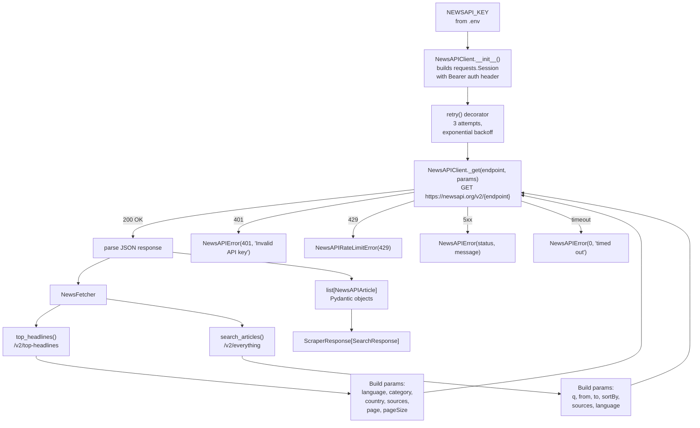

# 05 — NewsAPI Module

## Files Covered
- [`src/newsapi/newsapi_client.py`](../src/newsapi/newsapi_client.py)
- [`src/newsapi/news_fetcher.py`](../src/newsapi/news_fetcher.py)
- [`src/newsapi/source_manager.py`](../src/newsapi/source_manager.py)

> **Requires:** `NEWSAPI_KEY` set in `.env` or as environment variable.
> Get a free key at [newsapi.org](https://newsapi.org)

---

## How It Works



---

## Function Reference

### `newsapi_client.py`

#### `NewsAPIClient.__init__(api_key, timeout, max_retries)`
- Validates that `api_key` is non-empty (raises `ValueError` otherwise)
- Builds a `requests.Session` with `Authorization: Bearer <key>` header
- Configures a `HTTPAdapter` for connection pooling

#### `NewsAPIClient._get(endpoint, params) → dict`
Low-level GET with structured error handling:

| HTTP Status | Exception raised |
|-------------|-----------------|
| `401` | `NewsAPIError(401, "Invalid API key.")` |
| `429` | `NewsAPIRateLimitError(429, "Rate limit exceeded.")` |
| `4xx/5xx` | `NewsAPIError(code, message_from_body)` |
| Timeout | `NewsAPIError(0, "Request timed out")` |
| Connection error | `NewsAPIError(0, "Connection error")` |

#### `NewsAPIClient.get(endpoint, params) → dict`
Public method that wraps `_get` with the `@retry()` decorator (3 attempts, 2× backoff).

---

### `news_fetcher.py`

#### `NewsFetcher.top_headlines(*, query, sources, category, country, language, page_size, page)`
Calls `/v2/top-headlines`. Key notes:
- `sources` **cannot** be combined with `country` or `category` (NewsAPI restriction)
- `page_size` is capped at 100 (NewsAPI hard limit)
- Returns `ScraperResponse[SearchResponse]`

#### `NewsFetcher.search_articles(query, *, sources, language, from_date, to_date, sort_by, page_size, page)`
Calls `/v2/everything`:
- `sort_by`: `"publishedAt"` (default), `"relevancy"`, or `"popularity"`
- `from_date`/`to_date`: accepts `datetime` objects or `"YYYY-MM-DD"` strings
- Converts dates to ISO 8601 format before sending
- Empty `query` returns `ScraperResponse.fail()` immediately

---

### `source_manager.py`

#### `SourceManager.get_sources(category, language, country) → list[dict]`
Lists all available NewsAPI sources matching the filters.

#### `SourceManager.source_ids_by_category(category) → list[str]`
Returns just the IDs for sources in a category (e.g. `"technology"`).

#### `SourceManager.validate_source_ids(source_ids) → list[str]`
Filters a list of IDs to only those that actually exist in NewsAPI — unknown IDs are logged and dropped.

---

## Manual Testing

### Setup
```powershell
cd c:\LATEST\news_detection\Model_v3\news_scraper
$env:PYTHONPATH = (Get-Location).Path
$env:NEWSAPI_KEY = "your_actual_key_here"    # or set in .env file
C:\Users\vinuj\anaconda3\python.exe
```

### Test 1 — Validate the API key works
```python
from src.newsapi.newsapi_client import NewsAPIClient

# Will raise ValueError immediately if key is empty
try:
    client = NewsAPIClient(api_key="bad_key")
    data = client.get("top-headlines", {"country": "us", "pageSize": 1})
    print("Connected! Total results:", data.get("totalResults"))
except Exception as e:
    print("Error:", e)
```

### Test 2 — Fetch top headlines (real request)

> ⚠️ Requires a valid `NEWSAPI_KEY`.

```python
from src.newsapi.newsapi_client import NewsAPIClient
from src.newsapi.news_fetcher import NewsFetcher

with NewsAPIClient() as client:
    fetcher = NewsFetcher(client)
    resp = fetcher.top_headlines(country="us", category="technology", page_size=5)

if resp.success:
    print(f"Found {resp.data.total_found} articles | showed {len(resp.data.results)}")
    for art in resp.data.results:
        print(f"\n  📰 {art.title}")
        print(f"     By: {art.author or 'Unknown'}")
        print(f"     URL: {art.url}")
        print(f"     Published: {art.published_at}")
else:
    print("Failed:", resp.error)
```

### Test 3 — Keyword search with date range
```python
from src.newsapi.newsapi_client import NewsAPIClient
from src.newsapi.news_fetcher import NewsFetcher

with NewsAPIClient() as client:
    fetcher = NewsFetcher(client)
    resp = fetcher.search_articles(
        "artificial intelligence",
        language="en",
        from_date="2024-01-01",
        to_date="2024-03-31",
        sort_by="publishedAt",
        page_size=5,
    )

if resp.success:
    print(f"Total matching articles: {resp.data.total_found}")
    for art in resp.data.results:
        print(f"  - {art.published_at.date() if art.published_at else '?'} | {art.title[:60]}")
else:
    print("Failed:", resp.error)
```

### Test 4 — Filter by specific NewsAPI sources
```python
from src.newsapi.newsapi_client import NewsAPIClient
from src.newsapi.news_fetcher import NewsFetcher

with NewsAPIClient() as client:
    fetcher = NewsFetcher(client)
    # sources: bbc-news, cnn, the-verge, techcrunch
    resp = fetcher.top_headlines(
        sources=["bbc-news", "techcrunch"],
        page_size=3,
    )

if resp.success:
    for art in resp.data.results:
        print(art.source_name, "|", art.title[:60])
```

### Test 5 — List all technology sources
```python
from src.newsapi.newsapi_client import NewsAPIClient
from src.newsapi.source_manager import SourceManager

with NewsAPIClient() as client:
    mgr = SourceManager(client)
    ids = mgr.source_ids_by_category("technology")
    print(f"Technology sources ({len(ids)}):")
    for sid in ids[:10]:
        print(" -", sid)
```

### Test 6 — Test error handling (mock, no real key needed)
```python
from unittest.mock import MagicMock
from src.newsapi.newsapi_client import NewsAPIClient, NewsAPIError
from src.newsapi.news_fetcher import NewsFetcher

mock_client = MagicMock(spec=NewsAPIClient)
mock_client.get.side_effect = NewsAPIError(429, "Rate limit exceeded")

fetcher = NewsFetcher(mock_client)
resp = fetcher.search_articles("test")

print("Success:", resp.success)    # False
print("Error:", resp.error)        # "[429] Rate limit exceeded"
```

### Test 7 — Empty query is rejected immediately
```python
from unittest.mock import MagicMock
from src.newsapi.newsapi_client import NewsAPIClient
from src.newsapi.news_fetcher import NewsFetcher

fetcher = NewsFetcher(MagicMock(spec=NewsAPIClient))
resp = fetcher.search_articles("   ")  # whitespace only

print("Success:", resp.success)   # False
print("Error:", resp.error)       # "Query string cannot be empty."
```
