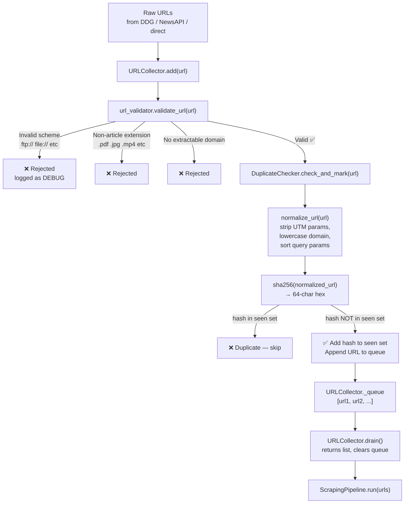

# 06 — Crawler / URL Management

## Files Covered
- [`src/crawler/url_validator.py`](../src/crawler/url_validator.py)
- [`src/crawler/duplicate_checker.py`](../src/crawler/duplicate_checker.py)
- [`src/crawler/url_collector.py`](../src/crawler/url_collector.py)

---

## How It Works



---

## Function Reference

### `url_validator.py`

#### `validate_url(url: str) → tuple[bool, Optional[str]]`
Returns `(True, None)` on success or `(False, reason_string)` on failure.

**Checks performed:**
1. URL is non-empty
2. Scheme is `http` or `https` (rejects `ftp://`, `file://`, etc.)
3. `netloc` (domain) is present
4. Path does not end in a blocked extension:

| Blocked extensions |
|---|
| `.pdf`, `.jpg`, `.jpeg`, `.png`, `.gif`, `.svg`, `.webp` |
| `.mp4`, `.mp3`, `.avi`, `.zip`, `.tar`, `.gz`, `.exe` |
| `.css`, `.js`, `.xml`, `.json`, `.rss` |

5. Domain can be extracted by `tldextract`

#### `resolve_relative_url(base: str, href: str) → Optional[str]`
Resolves a potentially relative URL (like `/about` or `../article`) against the
page's base URL. Returns `None` if the resulting URL fails validation.

---

### `duplicate_checker.py`

#### `DuplicateChecker.__init__(persist_path=None)`
- Creates an in-memory `set[str]` of seen SHA-256 hashes
- If `persist_path` is given and the file exists, loads hashes from it
  (so dedup survives across pipeline runs)

#### `DuplicateChecker.is_duplicate(url) → bool`
Normalises the URL, hashes it, checks if the hash is in `_seen`.

#### `DuplicateChecker.mark_seen(url)`
Normalises, hashes, and adds to `_seen`.

#### `DuplicateChecker.check_and_mark(url) → bool`
Atomic combine: returns `True` if duplicate, `False` if new (and marks it).

#### `DuplicateChecker.save()`
Writes the `_seen` set to the `persist_path` JSON file.

#### `DuplicateChecker.count → int`
Number of unique URLs tracked so far.

---

### `url_collector.py`

#### `URLCollector.__init__(dedup_checker=None)`
Creates the queue. If no `dedup_checker` is passed, creates a fresh one.
The Orchestrator passes a **shared** checker so dedup works across
DDG + NewsAPI + direct URL batches.

#### `URLCollector.add(url) → bool`
1. Strips whitespace
2. Calls `validate_url(url)`
3. Calls `dedup_checker.check_and_mark(url)`
4. If both pass → appends to `_queue`, returns `True`
5. Otherwise logs and returns `False`

#### `URLCollector.add_many(urls) → int`
Iterates and calls `add()` on each URL. Returns total accepted count.

#### `URLCollector.drain() → list[str]`
Returns a copy of the queue and **clears it** (resets to `[]`).

#### `URLCollector.pending → int`
Number of URLs currently in the queue.

---

## Manual Testing

### Setup
```powershell
cd c:\LATEST\news_detection\Model_v3\news_scraper
$env:PYTHONPATH = (Get-Location).Path
C:\Users\vinuj\anaconda3\python.exe
```

### Test 1 — Validate individual URLs
```python
from src.crawler.url_validator import validate_url

urls = [
    "https://bbc.com/news/article-123",      # ✅ Valid
    "http://reuters.com/story",               # ✅ Valid
    "ftp://example.com/file",                 # ❌ Bad scheme
    "https://example.com/doc.pdf",            # ❌ PDF extension
    "https://cdn.example.com/photo.jpg",      # ❌ Image extension
    "not-a-url-at-all",                       # ❌ No scheme
    "",                                        # ❌ Empty
    "https://example.com/news.json",          # ❌ JSON extension
]

for url in urls:
    valid, reason = validate_url(url)
    status = "✅" if valid else "❌"
    print(f"{status} {url[:50]:<50} {reason or ''}")
```

### Test 2 — URL normalisation (tracking param stripping)
```python
from src.utils.hash_utils import normalize_url, url_hash

pairs = [
    ("https://example.com/article", "https://example.com/article?utm_source=fb&fbclid=123"),
    ("https://bbc.com/news", "https://BBC.COM/news/"),           # case + trailing slash
    ("https://example.com/a?b=1&a=2", "https://example.com/a?a=2&b=1"),  # param ordering
]

for clean, variant in pairs:
    same = url_hash(clean) == url_hash(variant)
    print(f"{'✅ Same' if same else '❌ Different'} hash for:")
    print(f"  {clean}")
    print(f"  {variant}\n")
```

### Test 3 — DuplicateChecker in action
```python
from src.crawler.duplicate_checker import DuplicateChecker

checker = DuplicateChecker()

urls = [
    "https://example.com/article-1",
    "https://example.com/article-2",
    "https://example.com/article-1",                  # duplicate
    "https://example.com/article-1?utm_source=fb",   # same after normalisation
]

for url in urls:
    is_dup = checker.check_and_mark(url)
    print(f"{'DUP  🔄' if is_dup else 'NEW  ✅'} {url}")

print(f"\nTotal unique URLs tracked: {checker.count}")
```

**Expected:**
```
NEW  ✅ https://example.com/article-1
NEW  ✅ https://example.com/article-2
DUP  🔄 https://example.com/article-1
DUP  🔄 https://example.com/article-1?utm_source=fb

Total unique URLs tracked: 2
```

### Test 4 — Persist dedup state across sessions
```python
import tempfile
from pathlib import Path
from src.crawler.duplicate_checker import DuplicateChecker

# Session 1: scrape and save state
with tempfile.TemporaryDirectory() as tmp:
    path = Path(tmp) / "seen.json"

    checker1 = DuplicateChecker(persist_path=path)
    checker1.mark_seen("https://bbc.com/news/1")
    checker1.mark_seen("https://bbc.com/news/2")
    checker1.save()
    print(f"Session 1: saved {checker1.count} URLs")

    # Session 2: load and check
    checker2 = DuplicateChecker(persist_path=path)
    print(f"Session 2: loaded {checker2.count} URLs")
    print("Article-1 already seen:", checker2.is_duplicate("https://bbc.com/news/1"))
    print("Article-3 new:", not checker2.is_duplicate("https://bbc.com/news/3"))
```

### Test 5 — URLCollector full flow
```python
from src.crawler.url_collector import URLCollector

collector = URLCollector()

# Mix of valid, invalid, and duplicate URLs
urls = [
    "https://techcrunch.com/2024/01/ai-news",
    "https://wired.com/story/quantum-computing",
    "https://techcrunch.com/2024/01/ai-news",       # duplicate
    "https://cdn.example.com/image.jpg",              # image — rejected
    "not-a-url",                                      # invalid
    "https://arstechnica.com/science/article",
    "ftp://oldserver.com/data",                       # bad scheme
]

accepted = collector.add_many(urls)
print(f"Accepted {accepted}/{len(urls)} URLs")
print(f"Pending in queue: {collector.pending}")

queue = collector.drain()
print(f"\nQueue contents:")
for url in queue:
    print(" →", url)
print(f"\nAfter drain, pending: {collector.pending}")
```

**Expected:**
```
Accepted 3/7 URLs
Pending in queue: 3

Queue contents:
 → https://techcrunch.com/2024/01/ai-news
 → https://wired.com/story/quantum-computing
 → https://arstechnica.com/science/article

After drain, pending: 0
```

### Test 6 — Relative URL resolution
```python
from src.crawler.url_validator import resolve_relative_url

base = "https://example.com/news/2024/article.html"

hrefs = [
    "/about",                          # absolute path → https://example.com/about
    "../science/story",                # relative → https://example.com/news/science/story
    "https://other.com/article",       # already absolute
    "javascript:void(0)",              # invalid scheme
    "/downloads/report.pdf",           # blocked extension
]

for href in hrefs:
    resolved = resolve_relative_url(base, href)
    print(f"  {href:<40} → {resolved or '❌ None'}")
```
