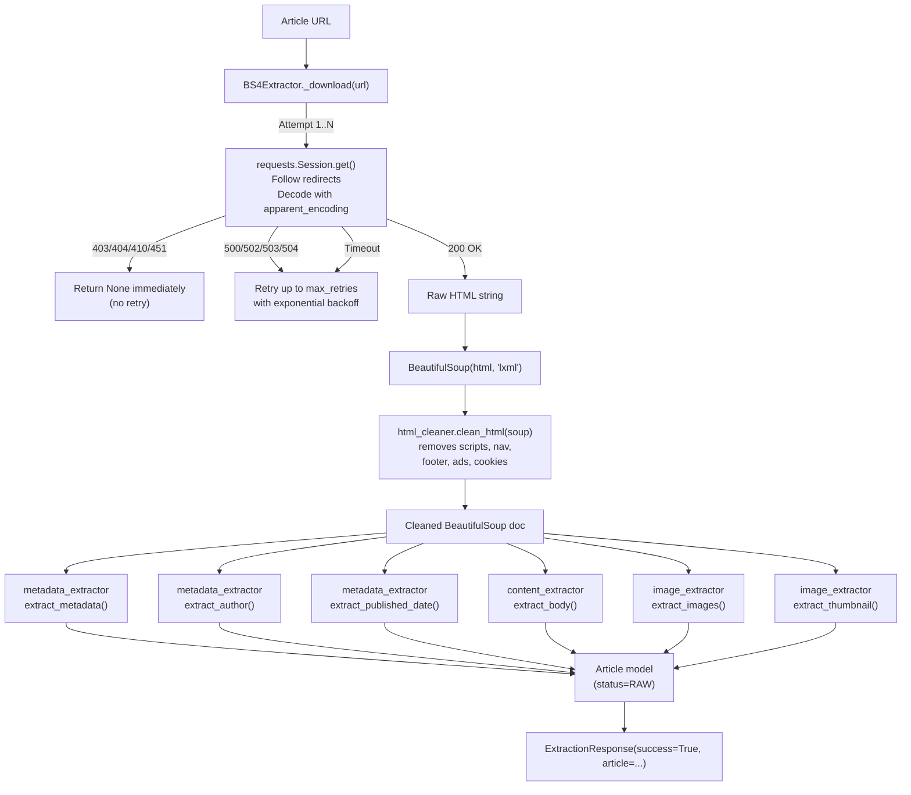
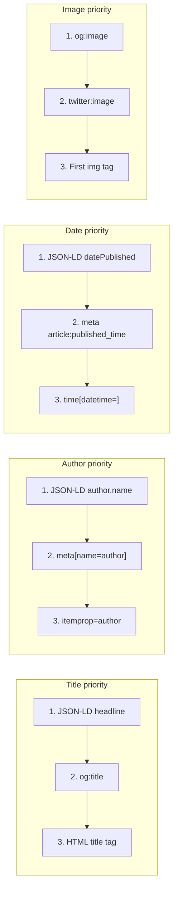
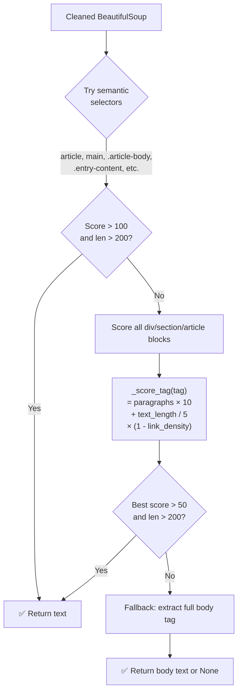

# 07 — Extractors

## Files Covered
- [`src/extractors/bs4_extractor.py`](../src/extractors/bs4_extractor.py) — main orchestrator
- [`src/extractors/metadata_extractor.py`](../src/extractors/metadata_extractor.py)
- [`src/extractors/content_extractor.py`](../src/extractors/content_extractor.py)
- [`src/extractors/image_extractor.py`](../src/extractors/image_extractor.py)

---

## Extraction Pipeline



---

## Metadata Extraction Priority



---

## Content Extraction Algorithm



**Link density penalty**: If a block is mostly links (like a navigation menu),
its score is multiplied by `(1 - link_text/total_text)` — heavily link-dense
blocks get near-zero scores.

---

## Function Reference

### `metadata_extractor.py`

#### `extract_metadata(soup, base_url) → ArticleMetadata`
Aggregates: JSON-LD, Open Graph, standard meta tags → `ArticleMetadata`.

#### `extract_author(soup) → Optional[str]`
Priority: JSON-LD `author.name` → `meta[name=author]` → `itemprop=author`.

#### `extract_published_date(soup) → Optional[datetime]`
Priority: JSON-LD `datePublished` → `meta[property=article:published_time]` → `<time datetime>`.
Always returns timezone-aware UTC datetime.

#### Private helpers:
- `_extract_jsonld(soup)` — merges all `<script type="application/ld+json">` blocks
- `_extract_opengraph(soup)` — returns dict of all `og:*` and `twitter:*` meta tags
- `_extract_standard_meta(soup)` — returns `title`, `description`, `canonical`, `keywords`

---

### `content_extractor.py`

#### `extract_body(soup) → Optional[str]`
Main content extraction. See algorithm above.

#### `_score_tag(tag) → float`
Paragraph-density scoring with link-density penalty.

#### `_is_noisy(tag) → bool`
Checks tag name and class/id against noise patterns (ads, sidebar, footer, etc.).

#### `_extract_text(tag) → str`
Recursively walks descendants, skips noise sub-tags, joins text fragments.

---

### `image_extractor.py`

#### `extract_images(soup, base_url, *, max_images) → list[ImageMeta]`
- Iterates all `` tags
- Resolves `src`, `data-src`, `data-lazy-src` attributes
- Skips `data:` URIs (inline base64 images)
- Filters out noise images (pixel, tracker, logo, icon, favicon, spinner, ad)
- Returns up to `max_images` (default 10)

#### `extract_thumbnail(soup, base_url) → Optional[str]`
Returns the single best image URL: `og:image` → `twitter:image` → first ``.

---

### `bs4_extractor.py`

#### `BS4Extractor.extract(url, *, source, search_query, snippet) → ExtractionResponse`
Full pipeline for one URL. Returns `ExtractionResponse(success=True/False, article=...)`.

#### `BS4Extractor._download(url) → tuple[html|None, final_url|None, error|None]`
Retry loop with status-code-aware bail-out:
- `403, 404, 410, 451` → return immediately (no retry — article gone)
- `500, 502, 503, 504` + `Timeout` → retry up to `max_retries`
- `TooManyRedirects` → return immediately

---

## Manual Testing

### Setup
```powershell
cd c:\LATEST\news_detection\Model_v3\news_scraper
$env:PYTHONPATH = (Get-Location).Path
C:\Users\vinuj\anaconda3\python.exe
```

### Test 1 — Parse metadata from raw HTML
```python
from bs4 import BeautifulSoup
from src.extractors.metadata_extractor import extract_metadata, extract_author, extract_published_date

html = """
<html>
<head>
  <title>AI Breakthrough | TechNews</title>
  <meta property="og:title" content="AI Makes Major Breakthrough" />
  <meta property="og:description" content="Researchers report a significant leap." />
  <meta property="og:image" content="https://example.com/hero.jpg" />
  <meta name="author" content="Jane Smith" />
  <meta property="article:published_time" content="2024-03-15T10:00:00Z" />
  <link rel="canonical" href="https://example.com/ai-breakthrough" />
</head>
<body><p>Article body here.</p></body>
</html>
"""

soup = BeautifulSoup(html, "lxml")

meta = extract_metadata(soup, "https://example.com")
print("OG Title:", meta.og_title)
print("OG Desc:", meta.og_description)
print("Canonical:", meta.canonical_url)

author = extract_author(soup)
print("Author:", author)

date = extract_published_date(soup)
print("Date:", date)
```

### Test 2 — JSON-LD extraction
```python
from bs4 import BeautifulSoup
from src.extractors.metadata_extractor import extract_author, extract_published_date

html = """
<html><head>
<script type="application/ld+json">
{
  "@type": "NewsArticle",
  "headline": "LD-JSON Article",
  "author": {"@type": "Person", "name": "Bob Jones"},
  "datePublished": "2024-06-01T08:30:00+00:00",
  "dateModified": "2024-06-01T12:00:00+00:00"
}
</script>
</head><body></body></html>
"""

soup = BeautifulSoup(html, "lxml")
print("Author:", extract_author(soup))
print("Date:", extract_published_date(soup))
```

### Test 3 — Content extraction from a realistic page
```python
from bs4 import BeautifulSoup
from src.preprocess.html_cleaner import clean_html
from src.extractors.content_extractor import extract_body

html = """
<html><body>
  <nav><a href="/">Home</a><a href="/about">About</a></nav>
  <header class="site-header">Site Header</header>
  <article>
    <h1>Scientists Discover New Particle</h1>
    <p>In a groundbreaking experiment at CERN, physicists have confirmed the
       existence of a new subatomic particle that could reshape our understanding
       of the Standard Model of particle physics.</p>
    <p>The discovery, published in Nature, involved over 5,000 researchers from
       45 countries working collaboratively over seven years.</p>
    <p>Lead researcher Dr. Elena Vasquez called it "the most significant finding
       since the Higgs boson" and predicted it would open entirely new fields of
       theoretical investigation.</p>
    <p>Further experiments are planned to confirm the particle's properties,
       with results expected by 2026.</p>
  </article>
  <aside class="sidebar">Related articles...</aside>
  <footer>Copyright 2024</footer>
  <script>alert("tracking")</script>
</body></html>
"""

soup = BeautifulSoup(html, "lxml")
clean = clean_html(soup)
body = extract_body(clean)

print(f"Extracted {len(body or '')} characters:")
print(body)
```

### Test 4 — Image extraction
```python
from bs4 import BeautifulSoup
from src.extractors.image_extractor import extract_images, extract_thumbnail

html = """
<html><head>
  <meta property="og:image" content="https://example.com/og-hero.jpg" />
</head><body>
  
  
  
  
</body></html>
"""

soup = BeautifulSoup(html, "lxml")
images = extract_images(soup, base_url="https://example.com")
thumbnail = extract_thumbnail(soup, base_url="https://example.com")

print("Thumbnail:", thumbnail)
print(f"\nExtracted {len(images)} images:")
for img in images:
    print(f"  - {img.url} | alt={img.alt} | {img.width}x{img.height}")
```

### Test 5 — Full extraction from a real URL (requires internet)
```python
from src.extractors.bs4_extractor import BS4Extractor
from src.schemas.article_schema import ArticleSource

with BS4Extractor() as extractor:
    result = extractor.extract(
        "https://www.bbc.com/news",
        source=ArticleSource.DIRECT,
        search_query="test",
    )

if result.success:
    art = result.article
    print(f"Title: {art.title}")
    print(f"Author: {art.author}")
    print(f"Published: {art.published_at}")
    print(f"Body length: {len(art.body or '')} chars")
    print(f"Images: {len(art.images)}")
    print(f"Thumbnail: {art.thumbnail_url}")
    print(f"Processing time: {result.elapsed_ms:.0f}ms")
else:
    print("Failed:", result.error)
```

### Test 6 — Test retry on timeout (mocked)
```python
from unittest.mock import patch, MagicMock
import requests
from src.extractors.bs4_extractor import BS4Extractor

call_count = [0]

def mock_get(*args, **kwargs):
    call_count[0] += 1
    if call_count[0] < 3:
        raise requests.exceptions.Timeout("timed out")
    # 3rd attempt succeeds
    resp = MagicMock()
    resp.status_code = 200
    resp.ok = True
    resp.url = args[0]
    resp.encoding = "utf-8"
    resp.content = b"<html><head><title>OK</title></head><body><article><p>Content text here that is long enough to pass validation checks.</p><p>More content to ensure minimum body length requirements are satisfied.</p></article></body></html>"
    return resp

extractor = BS4Extractor(max_retries=3)
with patch.object(extractor._session, "get", side_effect=mock_get):
    result = extractor.extract("https://example.com/article")

print(f"Attempts made: {call_count[0]}")
print(f"Success: {result.success}")
```
