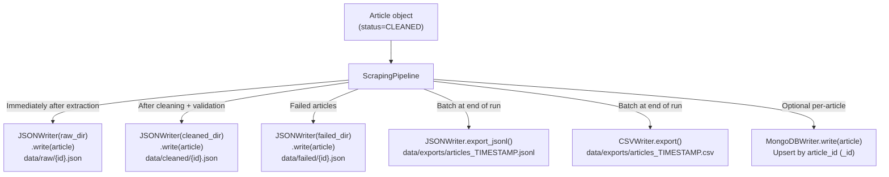

# 09 — Storage Backends

## Files Covered
- [`src/storage/json_writer.py`](../src/storage/json_writer.py)
- [`src/storage/csv_writer.py`](../src/storage/csv_writer.py)
- [`src/storage/mongodb_writer.py`](../src/storage/mongodb_writer.py)

---

## Storage Architecture



---

## File Naming Convention

| Location | Filename | Content |
|----------|----------|---------|
| `data/raw/` | `{sha256_hash}.json` | Article immediately after extraction, no cleaning |
| `data/cleaned/` | `{sha256_hash}.json` | Article after cleaning + language detection |
| `data/failed/` | `{sha256_hash}.json` | Failed/rejected articles with error reason |
| `data/exports/` | `articles_20240315_143022.jsonl` | All cleaned articles, one JSON object per line |
| `data/exports/` | `articles_20240315_143022.csv` | Same data in flat CSV format |

---

## Function Reference

### `json_writer.py`

#### `JSONWriter.__init__(output_dir: Path)`
Creates `output_dir` if it doesn't exist.

#### `JSONWriter.write(article: Article) → Path`
Saves one article as `{article_id}.json` (pretty-printed, 2-space indent, UTF-8).
Uses `article.model_dump_json()` for Pydantic-aware serialisation (handles `datetime`, `Enum`, etc.).

#### `JSONWriter.write_many(articles) → list[Path]`
Iterates and calls `write()` on each. Returns list of written file paths. Individual failures
are logged and skipped (batch continues).

#### `JSONWriter.export_jsonl(articles, export_path) → Path`
Writes one article per line (JSON Lines format). Great for streaming and big-data tools.

#### `JSONWriter.export_json_array(articles, export_path) → Path`
Writes all articles as a single JSON array (`[{...}, {...}]`).

---

### `csv_writer.py`

#### CSV Columns (in order)

| Column | Source |
|--------|--------|
| `article_id` | `article.article_id` |
| `url` | `article.url` |
| `title` | `article.title` |
| `author` | `article.author` |
| `published_at` | ISO 8601 string |
| `source` | `"duckduckgo"`, `"newsapi"`, `"direct"` |
| `source_url` | Original URL before redirects |
| `search_query` | Keyword that found this article |
| `snippet` | First 500 chars of snippet |
| `body_preview` | First 300 chars of body (newlines → spaces) |
| `word_count` | Number of words in body |
| `reading_time_minutes` | Estimated reading time |
| `language` | ISO 639-1 code (e.g. `"en"`) |
| `thumbnail_url` | Hero image URL |
| `tags` | Comma-separated tags |
| `status` | `"raw"`, `"cleaned"`, `"failed"` |
| `scraped_at` | ISO 8601 scrape timestamp |
| `processing_time_ms` | Extraction time in milliseconds |
| `error_message` | Reason for failure (if any) |

#### `CSVWriter.export(articles, filename) → Path`
Exports all articles at once. File is created/overwritten.

#### `CSVWriter.append(article, filename) → Path`
Appends a single row (creates file + header if it doesn't exist).
Useful for streaming writes during real-time pipeline runs.

> **Note:** CSV uses UTF-8 BOM (`utf-8-sig`) for compatibility with Microsoft Excel.

---

### `mongodb_writer.py`

#### Why MongoDB?
- Schema-flexible (articles vary in which optional fields are populated)
- Built-in indexing for fast queries on `url`, `published_at`, `source`, `status`
- Upsert-on-`article_id` means re-running the pipeline updates existing documents

#### `MongoDBWriter.__init__(uri, db_name, collection_name)`
- Connects with `serverSelectionTimeoutMS=5000` (fails fast if MongoDB is down)
- Creates indexes: `url`, `published_at`, `source`, `status`

#### `MongoDBWriter.write(article) → bool`
Upserts using `_id = article.article_id` (the SHA-256 hash).

#### `MongoDBWriter.write_many(articles) → int`
Bulk `UpdateOne` with `upsert=True` for efficiency. Returns count of written documents.
Handles partial `BulkWriteError` gracefully.

#### `MongoDBWriter.find_by_id(article_id) → Optional[dict]`
Retrieves a document by its `_id`.

#### `MongoDBWriter.count() → int`
Returns total documents in the collection.

---

## Manual Testing

### Setup
```powershell
cd c:\LATEST\news_detection\Model_v3\news_scraper
$env:PYTHONPATH = (Get-Location).Path
C:\Users\vinuj\anaconda3\python.exe
```

### Test 1 — Write a single article as JSON
```python
import tempfile
from pathlib import Path
from src.schemas.article_schema import Article, ArticleSource, ArticleStatus
from src.storage.json_writer import JSONWriter

# Create a test article
article = Article(
    article_id="test_article_001",
    url="https://example.com/ai-news",
    title="AI Research Advances in 2024",
    body="Scientists at leading universities have made remarkable strides "
         "in artificial intelligence research this year. New models demonstrate "
         "unprecedented reasoning capabilities across multiple domains.",
    source=ArticleSource.DIRECT,
    status=ArticleStatus.CLEANED,
)

with tempfile.TemporaryDirectory() as tmp:
    writer = JSONWriter(Path(tmp))
    path = writer.write(article)
    print(f"Written to: {path.name}")
    print(f"File size: {path.stat().st_size} bytes")

    import json
    data = json.loads(path.read_text())
    print(f"\nJSON keys: {list(data.keys())}")
    print(f"Title in JSON: {data['title']}")
    print(f"Status in JSON: {data['status']}")
```

### Test 2 — Export as JSONL (JSON Lines)
```python
import tempfile, json
from pathlib import Path
from src.schemas.article_schema import Article, ArticleSource
from src.storage.json_writer import JSONWriter

articles = [
    Article(article_id=f"art_{i}", url=f"https://example.com/{i}",
            title=f"Article {i}", snippet=f"Snippet for article {i}",
            source=ArticleSource.DUCKDUCKGO)
    for i in range(5)
]

with tempfile.TemporaryDirectory() as tmp:
    writer = JSONWriter(Path(tmp))
    export_path = Path(tmp) / "batch.jsonl"
    writer.export_jsonl(articles, export_path)

    # Each line is a separate JSON object
    lines = export_path.read_text().strip().split("\n")
    print(f"JSONL lines: {len(lines)}")
    for line in lines:
        obj = json.loads(line)
        print(f"  - {obj['article_id']}: {obj['title']}")
```

### Test 3 — Export as CSV and inspect columns
```python
import tempfile, csv
from pathlib import Path
from src.schemas.article_schema import Article, ArticleSource, ArticleStatus
from src.storage.csv_writer import CSVWriter

articles = [
    Article(
        article_id=f"csv_{i}",
        url=f"https://bbc.com/news/article-{i}",
        title=f"BBC Article {i}: Important News Today",
        body="This is an important article body. " * 20,
        author="John Doe",
        source=ArticleSource.NEWSAPI,
        status=ArticleStatus.CLEANED,
    )
    for i in range(3)
]

with tempfile.TemporaryDirectory() as tmp:
    writer = CSVWriter(Path(tmp))
    path = writer.export(articles, filename="test_export.csv")
    print(f"CSV path: {path}")
    print(f"File size: {path.stat().st_size} bytes\n")

    with open(path, encoding="utf-8-sig") as f:
        reader = csv.DictReader(f)
        print("Columns:", reader.fieldnames)
        for row in reader:
            print(f"\n  article_id: {row['article_id']}")
            print(f"  title:      {row['title'][:50]}")
            print(f"  source:     {row['source']}")
            print(f"  word_count: {row['word_count']}")
```

### Test 4 — CSV append mode (streaming write)
```python
import tempfile, csv
from pathlib import Path
from src.schemas.article_schema import Article, ArticleSource
from src.storage.csv_writer import CSVWriter

with tempfile.TemporaryDirectory() as tmp:
    writer = CSVWriter(Path(tmp))
    csv_file = "streaming.csv"

    # Append articles one by one (as they come in from the pipeline)
    for i in range(4):
        art = Article(
            article_id=f"stream_{i}",
            url=f"https://reuters.com/{i}",
            title=f"Reuters Story {i}",
            snippet=f"Summary of story {i}.",
            source=ArticleSource.NEWSAPI,
        )
        writer.append(art, filename=csv_file)
        print(f"Appended article {i}")

    # Verify
    path = Path(tmp) / csv_file
    with open(path, encoding="utf-8-sig") as f:
        rows = list(csv.DictReader(f))
    print(f"\nTotal rows in CSV: {len(rows)}")
```

### Test 5 — MongoDB write (requires MongoDB running)
```python
# Only run this if you have MongoDB installed and running
# Default: mongodb://localhost:27017

try:
    from src.storage.mongodb_writer import MongoDBWriter
    from src.schemas.article_schema import Article, ArticleSource, ArticleStatus

    with MongoDBWriter("mongodb://localhost:27017", "news_test", "articles") as writer:
        article = Article(
            article_id="mongo_test_001",
            url="https://example.com/mongo-test",
            title="MongoDB Test Article",
            body="Testing MongoDB storage integration. " * 10,
            source=ArticleSource.DIRECT,
            status=ArticleStatus.CLEANED,
        )
        success = writer.write(article)
        print(f"Write success: {success}")
        print(f"Total docs in collection: {writer.count()}")

        # Verify retrieval
        doc = writer.find_by_id("mongo_test_001")
        print(f"Retrieved title: {doc['title']}")

except Exception as e:
    print(f"MongoDB not available: {e}")
    print("(This is expected if MongoDB is not running)")
```

### Test 6 — Read back a JSON file from a real pipeline run
```python
import json
from pathlib import Path
from config.settings import settings

# List files in the cleaned data directory
cleaned_dir = settings.cleaned_data_dir
files = list(cleaned_dir.glob("*.json"))

if files:
    print(f"Found {len(files)} cleaned articles")
    # Read the first one
    data = json.loads(files[0].read_text(encoding="utf-8"))
    print(f"\nTitle: {data['title']}")
    print(f"URL:   {data['url']}")
    print(f"Body preview: {(data.get('body') or '')[:200]}...")
else:
    print("No cleaned articles yet — run the pipeline first!")
    print(f"Checked: {cleaned_dir}")
```
