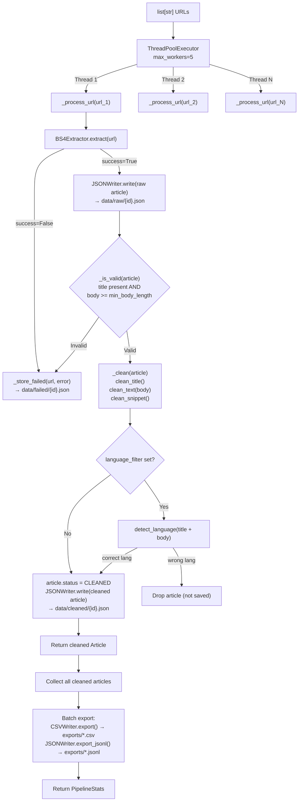
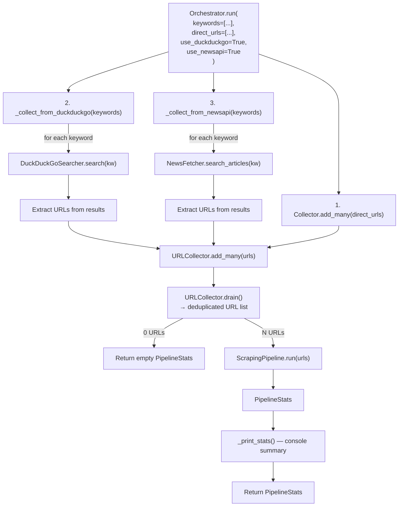
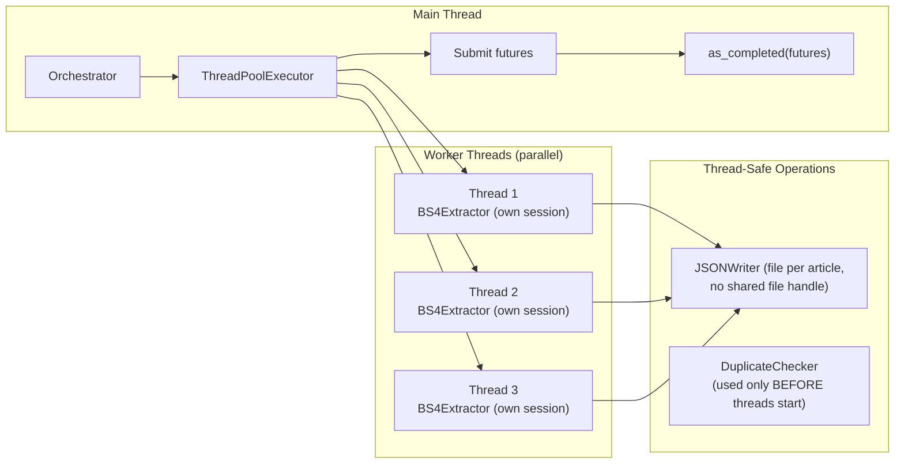

# 10 — Pipeline & Orchestrator

## Files Covered
- [`src/pipeline/scraping_pipeline.py`](../src/pipeline/scraping_pipeline.py)
- [`src/pipeline/orchestrator.py`](../src/pipeline/orchestrator.py)

---

## ScrapingPipeline — Per-URL Processing



---

## Orchestrator — Full System Coordination



---

## Thread Safety Model



**Why this is safe:**
- Each thread writes to a **unique file** (named by article_id hash) — no file contention
- `DuplicateChecker` runs **before** the thread pool, in the main thread
- `BS4Extractor` uses a **per-instance** `requests.Session` (one per thread)

---

## PipelineStats — What Gets Tracked

```python
PipelineStats(
    total_urls=20,      # How many URLs were submitted
    successful=17,      # Articles fully extracted and saved
    failed=3,           # Failed (network error, 404, too short, etc.)
    skipped_duplicates=0,  # (tracked by URLCollector before pipeline)
    elapsed_seconds=45.2,  # Wall-clock time for the full run
    articles_saved=17,  # Articles written to cleaned/ and exports/
    errors=[            # List of error messages for failed URLs
        "https://example.com/broken: HTTP 404",
        "https://paywalled.com/art: Max retries exceeded",
    ]
)
```

---

## Manual Testing

### Setup
```powershell
cd c:\LATEST\news_detection\Model_v3\news_scraper
$env:PYTHONPATH = (Get-Location).Path
C:\Users\vinuj\anaconda3\python.exe
```

### Test 1 — Run pipeline with mocked extractor
```python
import tempfile
from pathlib import Path
from unittest.mock import MagicMock, patch
from src.pipeline.scraping_pipeline import ScrapingPipeline
from src.schemas.article_schema import Article, ArticleSource, ArticleStatus
from src.schemas.response_schema import ExtractionResponse
from src.utils.hash_utils import url_hash

def make_article(url):
    return Article(
        article_id=url_hash(url),
        url=url,
        title=f"Article about {url.split('/')[-1]}",
        body="This is a properly long article body containing meaningful content. " * 5,
        source=ArticleSource.DIRECT,
        status=ArticleStatus.RAW,
    )

urls = [
    "https://example.com/article-1",
    "https://example.com/article-2",
    "https://example.com/article-3",
]

with tempfile.TemporaryDirectory() as tmp:
    p = Path(tmp)
    pipeline = ScrapingPipeline(
        raw_dir=p/"raw", cleaned_dir=p/"cleaned",
        failed_dir=p/"failed", exports_dir=p/"exports",
        max_workers=2,
    )

    with patch("src.pipeline.scraping_pipeline.BS4Extractor") as MockExt:
        mock_ext = MagicMock()
        mock_ext.__enter__ = MagicMock(return_value=mock_ext)
        mock_ext.__exit__ = MagicMock(return_value=False)
        mock_ext.extract.side_effect = lambda url, **kw: ExtractionResponse(
            url=url, success=True, article=make_article(url), elapsed_ms=100.0
        )
        MockExt.return_value = mock_ext

        stats = pipeline.run(urls=urls, source=ArticleSource.DIRECT)

    print(f"Total URLs:    {stats.total_urls}")
    print(f"Successful:    {stats.successful}")
    print(f"Failed:        {stats.failed}")
    print(f"Articles saved:{stats.articles_saved}")
    print(f"Elapsed:       {stats.elapsed_seconds:.2f}s")

    print(f"\nRaw files:     {len(list((p/'raw').glob('*.json')))}")
    print(f"Cleaned files: {len(list((p/'cleaned').glob('*.json')))}")
    print(f"Export files:  {list((p/'exports').iterdir())}")
```

### Test 2 — on_article callback (real-time processing)
```python
import tempfile
from pathlib import Path
from unittest.mock import MagicMock, patch
from src.pipeline.scraping_pipeline import ScrapingPipeline
from src.schemas.article_schema import Article, ArticleSource, ArticleStatus
from src.schemas.response_schema import ExtractionResponse
from src.utils.hash_utils import url_hash

received = []

def my_callback(article: Article):
    received.append(article.url)
    print(f"  📨 Got article: {article.title[:50]}")

url = "https://techcrunch.com/ai-story"

with tempfile.TemporaryDirectory() as tmp:
    p = Path(tmp)
    pipeline = ScrapingPipeline(
        raw_dir=p/"raw", cleaned_dir=p/"cleaned",
        failed_dir=p/"failed", exports_dir=p/"exports",
    )

    with patch("src.pipeline.scraping_pipeline.BS4Extractor") as MockExt:
        mock_ext = MagicMock()
        mock_ext.__enter__ = MagicMock(return_value=mock_ext)
        mock_ext.__exit__ = MagicMock(return_value=False)
        mock_ext.extract.return_value = ExtractionResponse(
            url=url, success=True,
            article=Article(
                article_id=url_hash(url), url=url,
                title="TechCrunch AI Story",
                body="The AI sector continues to evolve rapidly. " * 8,
                source=ArticleSource.DIRECT, status=ArticleStatus.RAW,
            ),
            elapsed_ms=150.0,
        )
        MockExt.return_value = mock_ext

        stats = pipeline.run(urls=[url], on_article=my_callback)

print(f"\nCallback received {len(received)} articles")
```

### Test 3 — Orchestrator with DuckDuckGo (real search, real scrape)

> ⚠️ This makes real network requests.

```python
from src.pipeline.orchestrator import Orchestrator

orch = Orchestrator(
    max_workers=3,
    language_filter="en",
    min_body_length=300,
)

stats = orch.run(
    keywords=["Python web scraping 2024"],
    use_duckduckgo=True,
    use_newsapi=False,
    ddg_max_results=5,
)

print(f"\n=== Run Complete ===")
print(f"Processed: {stats.total_urls} URLs")
print(f"Saved:     {stats.articles_saved} articles")
print(f"Failed:    {stats.failed}")
print(f"Time:      {stats.elapsed_seconds:.1f}s")
```

### Test 4 — Check what was saved after a pipeline run
```python
import json
from pathlib import Path
from config.settings import settings

print("=== RAW ARTICLES ===")
for f in list(settings.raw_data_dir.glob("*.json"))[:3]:
    data = json.loads(f.read_text())
    print(f"  {data['title'][:60]}")
    print(f"  URL: {data['url'][:70]}")
    print(f"  Status: {data['status']}\n")

print("=== EXPORT FILES ===")
for f in settings.exports_dir.iterdir():
    size_kb = f.stat().st_size / 1024
    print(f"  {f.name}: {size_kb:.1f} KB")
```

### Test 5 — Pipeline failure handling (mock 404)
```python
import tempfile
from pathlib import Path
from unittest.mock import MagicMock, patch
from src.pipeline.scraping_pipeline import ScrapingPipeline
from src.schemas.response_schema import ExtractionResponse

urls = [
    "https://example.com/good-article",
    "https://example.com/returns-404",
    "https://example.com/another-good",
]

def mock_extract(url, **kw):
    if "404" in url:
        return ExtractionResponse(url=url, success=False, error="HTTP 404", elapsed_ms=50.0)
    from src.schemas.article_schema import Article, ArticleSource, ArticleStatus
    from src.utils.hash_utils import url_hash
    return ExtractionResponse(
        url=url, success=True, elapsed_ms=100.0,
        article=Article(
            article_id=url_hash(url), url=url,
            title=f"Good Article at {url}", source=ArticleSource.DIRECT,
            body="Good content that is long enough. " * 10,
            status=ArticleStatus.RAW,
        )
    )

with tempfile.TemporaryDirectory() as tmp:
    p = Path(tmp)
    pipeline = ScrapingPipeline(
        raw_dir=p/"raw", cleaned_dir=p/"cleaned",
        failed_dir=p/"failed", exports_dir=p/"exports",
        max_workers=1,
    )

    with patch("src.pipeline.scraping_pipeline.BS4Extractor") as MockExt:
        mock_ext = MagicMock()
        mock_ext.__enter__ = MagicMock(return_value=mock_ext)
        mock_ext.__exit__ = MagicMock(return_value=False)
        mock_ext.extract.side_effect = mock_extract
        MockExt.return_value = mock_ext

        stats = pipeline.run(urls=urls)

    print(f"Successful: {stats.successful}")
    print(f"Failed: {stats.failed}")
    failed_files = list((p/"failed").glob("*.json"))
    print(f"Failed records saved: {len(failed_files)}")
    if failed_files:
        import json
        d = json.loads(failed_files[0].read_text())
        print(f"Failure reason: {d['error_message']}")
```
